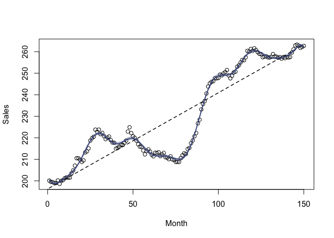

<!-- README.md is generated from README.Rmd. Please edit that file -->

# **bases** <a href="https://corymccartan.com/bases/"></a>

<!-- badges: start -->

[](https://github.com/CoryMcCartan/bases/actions/workflows/R-CMD-check.yaml)
<!-- badges: end -->

**bases** provides various basis expansions for flexible regression
modeling, including random Fourier features (`?b_rff`), exact kernel /
Gaussian process feature maps (`?b_ker`), Bayesian Additive Regression
Trees prior features (`?b_bart`), and a helpful interface for n-way
interactions (`?b_inter`). The provided functions may be used within any
modeling formula, allowing the use of kernel methods and other basis
expansions in modeling functions that do not otherwise support them.

Along with the basis expansions, a number of kernel functions
(`?kernels`) are also provided, which support kernel arithmetic to form
new kernels. Basic ridge regression functionality (`?ridge`) is included
as well.

Finally, the package provides a
[recipes](https://recipes.tidymodels.org/)-friendly interface, so that
these basis expansions can be combined with other transformations and
used within the [tidymodels](https://www.tidymodels.org/) framework.

## Installation

You can install **bases** from CRAN:

``` r
install.packages("bases")
```

You can install the development version with

``` r
remotes::install_github("CoryMcCartan/bases")
```

## Example: random Fourier features

The basis functions in **bases** all start with `b_` and are designed to
work in the same way as built-in basis expansions like `bs()` or
`poly()`: simply include the function in a model formula.

So fitting an approximate kernel regression with random Fourier features
is as simple as wrapping the relevant variables in a call to the
corresponding basis function, `b_rff()`. The default kernel is a
Gaussian/RBF kernel with length scale 1 which is applied to predictors
after rescaling them to have unit variance.

``` r
library(bases)

# Box & Jenkins (1976) sales data
x = 1:150
y = as.numeric(BJsales) 

lm(y ~ b_rff(x, p = 5)) # 5 random features
#> 
#> Call:
#> lm(formula = y ~ b_rff(x, p = 5))
#> 
#> Coefficients:
#>      (Intercept)  b_rff(x, p = 5)1  b_rff(x, p = 5)2  b_rff(x, p = 5)3  
#>         -1821607             12882             33383            -35639  
#> b_rff(x, p = 5)4  b_rff(x, p = 5)5  
#>            88853           4123981
```

You can provide a different `kernel =` argument to switch kernels. Many
common kernels are provided with the package; see `?kernels`.

``` r
b_rff(x, kernel = k_matern(scale = 0.1, nu = 5/2))
b_rff(x, kernel = k_rq(scale = 2, alpha = 2))
```

In practice, RFF are usually fit with penalization, such as via ridge
regression. Below, we visualize several RFF ridge regression fits versus
a simple linear model, using the `ridge()` function provided in the
package.

``` r
k = k_rbf(scale = 0.2)
plot(x, y, xlab = "Month", ylab = "Sales")
lines(x, fitted(lm(y ~ x)), lty = "dashed", lwd = 1.5)
for (i in 1:20) {
    m_rff = ridge(y ~ b_rff(x, kernel = k))
    lines(x, fitted(m_rff), col = "#4584")
}
```


